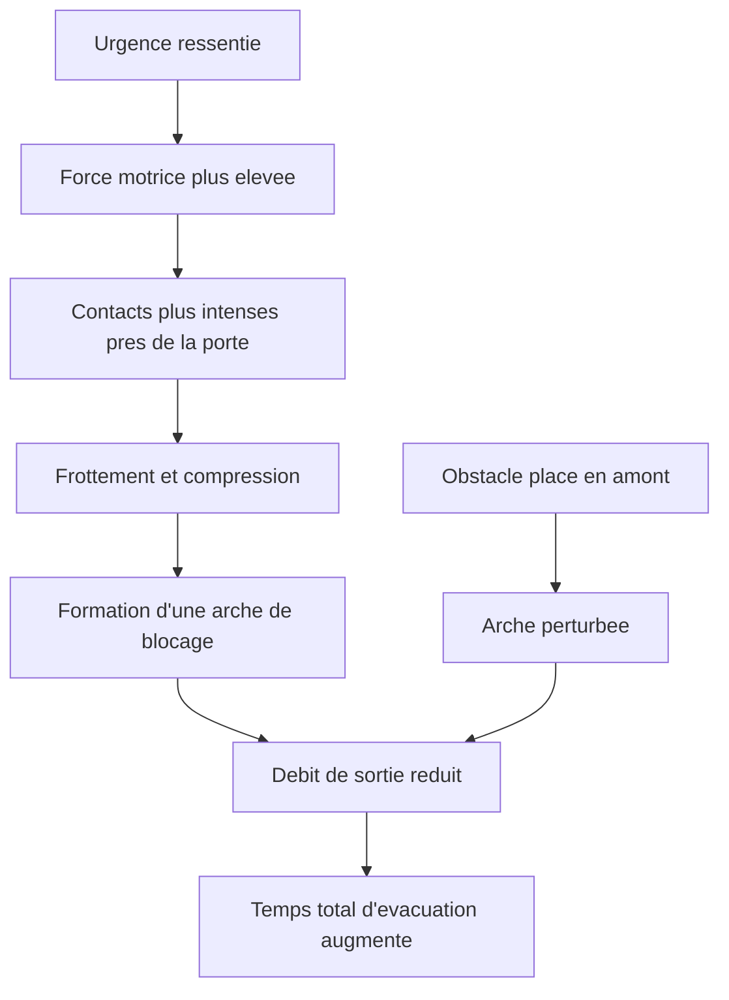

# Mecanisme observe

```mermaid
flowchart TD
    A[Urgence ressentie] --> B[Force motrice plus elevee]
    B --> C[Contacts plus intenses pres de la porte]
    C --> D[Frottement et compression]
    D --> E[Formation d'une arche de blocage]
    E --> F[Debit de sortie reduit]
    F --> G[Temps total d'evacuation augmente]
    H[Obstacle place en amont] --> I[Arche perturbee]
    I --> F
```

Le diagramme presente les mecanismes a tester, pas un resultat garanti. Les courbes CSV doivent confirmer ou infirmer chaque lien.